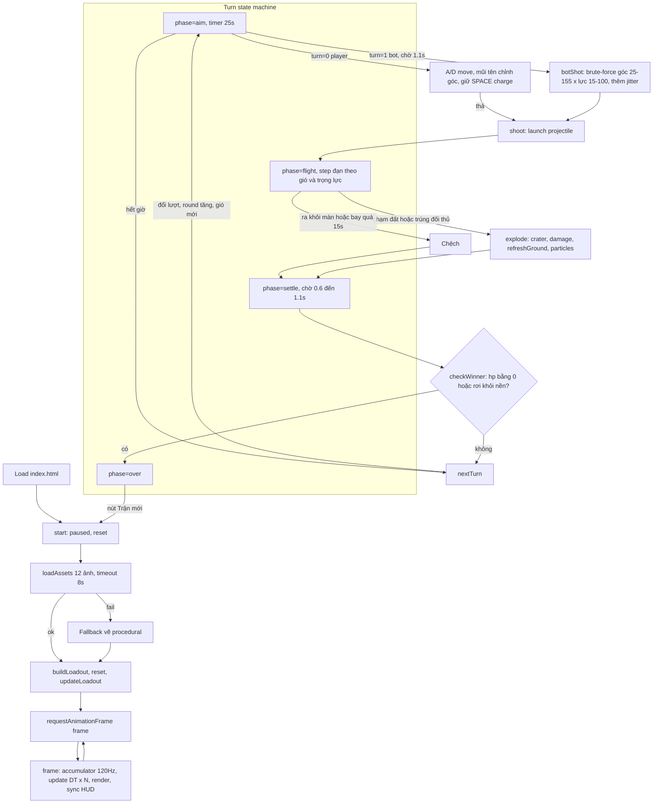

# Review code · Gunny Chibi Arena v0.2

Ngày review: 2026-09-15. Phạm vi: toàn bộ `src/`, `index.html`, `tests/`, `scripts/`.

## Tổng quan

Vanilla JS, không build step, không backend. Bốn file nguồn, khoảng 840 dòng. Tách lớp rõ:

| File | Vai trò |
|---|---|
| `src/physics.js` | Logic thuần: heightmap địa hình, đạn, crater, sát thương, bot AI. Không chạm DOM. Có unit test. |
| `src/assets.js` | Manifest 12 asset và loader có timeout, fallback. |
| `src/sprites.js` | Vẽ sprite nhân vật, vũ khí; cache layer địa hình. |
| `src/match.js` | State machine trận đấu, thuần, không DOM. Có unit test. |
| `src/game.js` | Input, render Canvas, HUD. Chỉ đọc và ghi vào `Match`. |

Trạng thái kiểm tra: `npm test` 5/5 pass, `npm run check` pass.

## Flow app



Đường vào state từ input:

- Pointer trên `#fire`, `#left`, `#right` dùng `setPointerCapture`; keyboard bắt ở window. Cả hai ghi vào `keys` Set và cờ `charging`.
- `#help` hoặc tab bị ẩn đặt `paused = true` và xóa keys.
- Nút loadout chỉ đổi skin hoặc vũ khí khi player đang ở phase aim.

## Điểm tốt

- Physics thuần, có test, fixed-timestep 120 Hz với clamp 0.1 s mỗi frame.
- Fallback asset đầy đủ: mất ảnh vẫn chơi được. Smoke test Playwright cover case này.
- Layer địa hình chỉ rebuild sau crater, không rebuild mỗi frame.
- Accessibility: aria-label, aria-pressed, dialog native, HUD là HTML.

## Vấn đề và feedback

Đã fix trong commit này:

- **Hardcode tên bot "Hạt Dẻ" trong message.** `nextTurn()` và `checkWinner()` dùng chuỗi cố định. Đã đổi sang `actors[1].name` để đổi skin bot sau này không lệch text.
- **Ba con số khác nhau cho "tâm nhân vật".** `damage()` dùng `y - 20`, hit-test đạn dùng `y - 25`, sprite cao 112. Đã gom thành hằng `BODY_OFFSET = 20` trong `physics.js`, dùng chung cho damage và hit-test. Hit-box đạn dịch xuống 5 px so với trước, không đổi test.

Chưa fix, cần quyết định:

1. **Bot brute-force trên main thread.** Mỗi lượt bot chạy khoảng 1.900 lần `simulate`, mỗi lần tối đa 1.800 step, tổng cỡ 3,4 triệu step. Máy yếu có thể khựng 100 đến 300 ms. Chưa có report lag. Nếu cần: Web Worker hoặc giảm mật độ lưới góc và lực.
2. **State player một phần nằm trong DOM.** `$("angle").value` là source of truth cho góc bắn của player, còn `actors[1].angle` là source cho bot. Không bug, nhưng khó test và khó mở rộng sang bot-vs-bot hoặc multiplayer. Nếu mở rộng, chuyển góc player vào `actors[0].angle` và chỉ sync ra slider.
3. **Fallback vẽ nhân vật procedural** trong `character()` khoảng 80 dòng ellipse hardcode, cộng fallback nền và địa hình khoảng 100 dòng nữa. Chỉ chạy khi ảnh lỗi. Giữ hay bỏ tùy quyết định. Bỏ giảm game.js khoảng 30 phần trăm.
4. **`move()` gọi `checkWinner()`** dù di chuyển không thể rơi khỏi nền, vì `y` luôn bằng `terrain[x]`. Vô hại, có thể bỏ.
5. **Bot cố định skin `hat-de`**, cũng là lựa chọn của player. Chọn Hạt Dẻ thì hai bên trùng sprite. Khi asset mới về, cân nhắc bot chọn random skin khác player.
6. **Smoke test Playwright không nằm trong `npm test`.** Chấp nhận được với repo static, nhưng nên ghi rõ trong README cách chạy.
7. **Smoke test flaky.** Đã sửa. Chẩn đoán ban đầu sai: dòng lỗi trỏ vào check terrain cache vì đếm nhầm dòng, thực ra assert fail là `#fire` enabled trên trang fallback. Trang thứ hai mở nền bị `document.hidden`, game đặt `paused`, `requestAnimationFrame` bị throttle nên `sync()` không chạy và nút không bao giờ enable. Có sẵn từ commit gốc. Sửa trong `scripts/browser-smoke.cjs`: `bringToFront()` rồi `waitForFunction` tới khi nút enable. Chạy 4 lần liên tiếp đều PASS.

## Lưu ý khi thay asset mới

- Loader đọc manifest trong `src/assets.js`. Thêm hoặc đổi asset chỉ cần sửa `CHARACTERS`, `WEAPONS`, `ENVIRONMENT`. ID phải khớp với `actors[].skin` và `actors[].weapon`.
- Sprite nhân vật: PNG nền trong suốt, pose idle quay phải, chân ở đáy ảnh. Runtime đặt chân tại `actor.y`, scale cao 112 px, lật ngang khi ngắm trái.
- Sprite vũ khí: vẽ tại `actor.y - 30`, kích thước 48x36, xoay theo góc, lật dọc khi góc lớn hơn 90.
- Nền: 2:1, vẽ full 1200x620. Địa hình: texture cắt theo heightmap, phần trên `terrain[x]` bị xóa.
- Ảnh tải lỗi hoặc quá 8 s rơi về vẽ procedural. Kiểm tra bằng cách chặn `**/assets/**` như trong `scripts/browser-smoke.cjs`.
- Smoke test giả định đúng 4 nhân vật và 6 vũ khí. Đổi số lượng thì sửa test.

## Đánh giá khả năng mở rộng

Phần này trả lời: code hiện tại chịu được những thay đổi nào, cần đụng chỗ nào, và cái gì nên làm trước.

### 1. Thay đổi skin

Hiện trạng:

- `CHARACTERS` trong `src/assets.js` chỉ có `id`, `name`, `file`. Skin thuần cosmetic, không có chỉ số.
- Player chọn skin bất kỳ lúc nào trong phase aim của mình, kể cả giữa trận. Bot cố định `hat-de`.
- `drawCharacter()` vẽ một ảnh tĩnh, lật ngang theo hướng ngắm. Không có frame.

Mở rộng dễ:

- Bot chọn skin random khác player: sửa `reset()` trong `src/game.js`, lọc `CHARACTERS` bỏ `selectedCharacter`. Khoảng 3 dòng.
- Thêm skin mới: thêm một dòng vào `CHARACTERS` và một file PNG. Smoke test đang assert đúng 4 nhân vật, phải sửa theo.

Mở rộng cần cân nhắc:

- Nếu skin có chỉ số (HP, năng lượng di chuyển, sát thương), phải khóa chọn skin trước trận, không cho đổi giữa trận như hiện tại. Loadout hiện chỉ cần điều kiện `turn === 0 && phase === "aim"`. Sẽ cần thêm phase `lobby` trước `aim`.
- Chỉ số per-skin nên nằm trong manifest `CHARACTERS` (ví dụ `hp: 100`, `energy: 60`) và `reset()` đọc từ đó. Tránh rải số cứng như `hp: 100`, `energy = 60` hiện tại.

### 2. Loại đạn và ảnh hưởng vật lý

Hiện trạng:

- `WEAPONS` chỉ có `id`, `name`, `file`, `color`. HTML ghi rõ "Cùng chỉ số, khác diện mạo".
- Vật lý cố định: `launch()` tốc độ `160 + power * 6`, `GRAVITY = 290`, gió cộng thẳng vào `vx` mỗi step. `crater()` bán kính mặc định 48. `damage()` tối đa 42, tắt ở khoảng cách 95.
- Bot dùng `simulate()` với cùng `launch()` và `step()`, nên bot tự động đúng với mọi thay đổi vật lý miễn là thay đổi đi qua hai hàm đó.

Đề xuất thiết kế: thêm object `ammo` vào mỗi weapon, lưu các tham số lên projectile khi `launch()`, `step()` đọc từ projectile.

```js
// assets.js
{ id: "acorn", name: "Cối hạt dẻ", file: "...", color: "...",
  ammo: { gravityScale: 1.3, windScale: 0.5, craterRadius: 60, damageMax: 55, damageRadius: 80 } }
{ id: "bubble", name: "Súng bong bóng", file: "...", color: "...",
  ammo: { gravityScale: 0.6, windScale: 2.0, craterRadius: 30, damageMax: 28, damageRadius: 110 } }
```

```js
// physics.js
export function launch(actor, angle, power, ammo = DEFAULT_AMMO) { ...; return { x, y, vx, vy, age: 0, ammo }; }
export function step(p, wind, dt = DT) { p.vx += wind * p.ammo.windScale * dt; p.vy += GRAVITY * p.ammo.gravityScale * dt; ... }
export function damage(actor, x, y, ammo = DEFAULT_AMMO) { ... ammo.damageMax * (1 - d / ammo.damageRadius) ... }
```

`crater()` đã nhận `r`, chỉ cần `explode()` truyền `p.ammo.craterRadius`. `botShot()` và `simulate()` thêm tham số `ammo`. Test hiện tại giữ được nhờ giá trị mặc định.

Tính hợp lý vật lý, gợi ý cho 6 vũ khí hiện có:

| Vũ khí | Ý tưởng | gravityScale | windScale | craterRadius (đề xuất ban đầu, nay là craterWidth x craterDepth) | damageMax | Ghi chú |
|---|---|---|---|---|---|---|
| Cà rốt | Chuẩn | 1.0 | 1.0 | 48 | 42 | Giữ nguyên, làm mốc |
| Hạt dẻ | Nặng, phá đất | 1.3 | 0.5 | 64 | 50 | Tầm ngắn, bot dễ đoán |
| Mật ong | Dính | 1.0 | 1.0 | 24 | 30 | Đối thủ mất 30 năng lượng lượt sau. Cần thêm trạng thái `slowed` trên actor |
| Bong bóng | Nhẹ, bay theo gió | 0.6 | 2.0 | 20 | 28 | Khó ngắm, ít phá đất |
| Cá nước | Xói mòn | 1.0 | 1.0 | 40 | 25 | Crater rộng nhưng nông: thêm tham số `craterDepth`, `crater()` hiện dùng nửa hình tròn, cần sửa thành ellipse |
| Ná sao | Chùm | 0.9 | 1.0 | 18 x 3 | 18 x 3 | Tách 3 viên tại đỉnh quỹ đạo (`vy` đổi dấu). Cần `projectile` thành mảng |

Cân bằng cần chú ý:

- Crater lớn không chỉ tăng sát thương gián tiếp mà còn làm actor rơi khỏi nền nhanh hơn. Địa hình ở khoảng y 400 đến 476, ngưỡng rơi `HEIGHT - 20 = 600`. Với bán kính 64, ba phát trúng cùng chỗ đủ giết bằng rơi. Nên giới hạn `craterRadius` tối đa khoảng 64, hoặc thêm sàn đá không phá được tại y 560.
- Hiện không có sát thương rơi. Actor tụt xuống crater không mất máu. Nếu muốn hợp lý hơn: trong `explode()`, lưu `y` cũ, nếu `newY - oldY > 40` thì trừ thêm `(newY - oldY) / 4` HP. Nhỏ, dễ test.
- `damage()` đo tới `BODY_OFFSET` trên chân, còn crater khoét từ điểm nổ. Đạn nổ dưới chân thì damage nhỏ hơn đạn nổ ngang ngực dù cùng khoảng cách ngang. Chấp nhận được, đúng cảm giác Gunny.
- Bot brute-force đang ~1.900 sim mỗi lượt. Nếu bot cũng được chọn vũ khí thì nhân theo số vũ khí. Nên cho bot vũ khí cố định hoặc chọn trước lượt rồi chỉ sim một loại.
- Đạn chùm và đạn dính làm `phase` phức tạp hơn: `flight` phải chờ mọi viên kết thúc. Làm sau cùng.

### 3. Hiệu ứng đường đạn

Hiện trạng:

- Projectile là ellipse màu `weapon.color`, bán kính 8, không xoay.
- Trail: mỗi step 40 phần trăm xác suất push điểm, tối đa 50 điểm, vẽ ellipse mờ dần màu cố định `#fff9dfbb`. Trail phụ thuộc số step, nghĩa là phụ thuộc thời gian bay, không phụ thuộc quãng đường.
- Đường ngắm dự đoán khi aim: 38 step 0.025 s, vẽ chấm mỗi 4 step. Chưa dùng `ammo`, sau khi thêm ammo phải truyền vào để đường ngắm đúng với đạn.

Đề xuất theo chi phí tăng dần:

1. Trail lấy màu từ `weapon.color`. Một dòng.
2. Projectile xoay theo hướng bay bằng `Math.atan2(vy, vx)`, vẽ sprite đạn thay ellipse. Cần 6 sprite đạn nhỏ, khoảng 32x32, nền trong suốt, hướng phải. Thêm vào `WEAPONS` field `projectile`.
3. Trail theo loại đạn: bong bóng để lại bọt nhỏ nổi lên, hạt dẻ để lại khói, sao để lại lấp lánh. Biến `trail` thành mảng particle có `vx`, `vy`, `life` như `particles` hiện tại, tái dùng vòng update.
4. Camera theo đạn hoặc zoom khi đạn bay cao hơn màn hình. Hiện đạn bay quá `y < 0` vẫn tiếp tục nhưng không nhìn thấy. Có thể thêm mũi tên chỉ vị trí đạn trên đỉnh màn hình, rẻ hơn camera.

### 4. Animation

Hiện trạng:

- Sprite tĩnh, một pose idle mỗi nhân vật. `assets/README.md` ghi rõ không có sheet đi bộ hay bắn.
- Hiệu ứng duy nhất: 28 particle nổ sống 0,7 s, tam giác vàng chỉ lượt, trail.
- Vòng lặp `frame()` gọi `update(DT)` cố định rồi `render()`. Animation phải tính trong `render()` theo thời gian thực, không nhét vào `update()` để giữ vật lý deterministic.

Hai hướng:

Hướng A, procedural, không cần asset mới. Làm được ngay:

- Đi bộ: nhún dọc `sin(time * 12) * 3` khi `keys` có left hoặc right.
- Bắn: recoil, dịch sprite ngược hướng ngắm 6 px trong 0,15 s, vũ khí giật.
- Trúng đạn: nhấp nháy trắng 0,2 s bằng `globalCompositeOperation = "lighter"` hoặc tô đè ellipse trắng alpha.
- Charge lực: sprite rung nhẹ theo `charge`.
- Nổ: rung màn hình, `ctx.translate` ngẫu nhiên 4 px trong 0,3 s, giảm dần.
- Số sát thương bay lên từ đầu actor, sống 1 s.
- Thắng thua: sprite nhảy hoặc ngã bằng `rotate`.

Tất cả cần một mảng `tweens` hoặc vài timestamp trong `game.js`, khoảng 60 đến 80 dòng. Không đụng physics.

Hướng B, sprite nhiều frame. Cần asset:

- Image generator tạo sheet nhiều frame thường không nhất quán về scale, anchor và màu giữa frame. Khuyến nghị yêu cầu từng pose riêng lẻ thay vì sheet: `idle`, `fire`, `hurt`, `win` cho mỗi nhân vật, cùng kích thước canvas, chân cùng baseline. Tổng 16 PNG cho 4 nhân vật.
- Loader hiện tại tải từng file, không cần sửa. `CHARACTERS` thêm `poses: { idle, fire, hurt }`. `drawCharacter()` nhận tên pose.
- Không nên làm walk cycle bằng AI, tốn nhiều frame và hay lỗi. Dùng nhún procedural của hướng A.

Khuyến nghị: làm A trước, dùng B chỉ cho 3 pose `fire`, `hurt`, `win`.

### 5. Thứ tự đề xuất

| Bước | Việc | Đụng file | Rủi ro | Cần asset mới |
|---|---|---|---|---|
| 1 | Bot random skin khác player. Đã làm | game.js | Thấp | Không |
| 2 | Trail theo màu vũ khí, đạn xoay theo hướng bay. Đã làm | game.js | Thấp | Không |
| 3 | Animation procedural: recoil, nhún khi đi, nháy khi trúng, rung màn hình, số sát thương. Đã làm | game.js, sprites.js | Thấp | Không |
| 4 | Ammo params: gravityScale, windScale, craterRadius, damageMax, damageRadius; truyền qua launch, step, damage, botShot; đường ngắm dùng ammo. Đã làm | physics.js, assets.js, game.js, tests | Trung bình, cần rebalance và sửa test | Không |
| 5 | Sát thương rơi và lớp đá. Đã làm, xem mục 9 | physics.js, game.js, tests | Thấp | Không |
| 6 | Sprite đạn riêng | assets.js, game.js | Thấp | 6 PNG 32x32 |
| 7 | Pose fire, hurt, win | assets.js, sprites.js, game.js | Thấp | 12 PNG |
| 8 | Đạn dính, đạn chùm | physics.js, game.js | Cao, đổi state machine | Không |

Mỗi bước là một commit riêng, test pass trước và sau.

### 6. Danh sách asset cần đặt hàng

Gửi cho model thiết kế asset, cùng style với pack hiện tại:

- 6 sprite đạn, 32x32, nền trong suốt, hướng phải, không bóng đổ: cà rốt, hạt dẻ, giọt mật, bong bóng, cá, sao.
- 4 nhân vật x 3 pose `fire`, `hurt`, `win`, cùng canvas và baseline với pose idle hiện có, hướng phải, tay trống, có gutter 4 px như pack cũ.
- Tùy chọn: 1 sprite hiệu ứng nổ 3 frame 96x96, nếu muốn thay particle. Không bắt buộc, particle hiện tại đủ dùng.

### 7. Ghi chú sau khi làm bước 1 đến 3

- Mọi timer hiệu ứng (`fire`, `hurt`, `moving` trên actor, `shake`, `popups`) giảm trong `update(dt)`, nên tạm dừng thì hiệu ứng cũng dừng, và không ảnh hưởng vật lý. Vẽ hoàn toàn trong `render()`.
- Recoil và nhún áp qua một `ctx.translate` bọc cả sprite lẫn vũ khí trong `character()`, dùng chung cho cả đường vẽ sprite và đường fallback. Flash trúng đạn chỉ có ở đường sprite: vẽ lại sprite với `globalCompositeOperation = "lighter"`, không cần mask vì chỉ sáng lên trên pixel của sprite.
- Rung màn hình là `ctx.translate` ngẫu nhiên tối đa 6 px trong 0,3 s. Viền canvas lộ nền `.arena` màu `#b2e2df` vài px khi rung, nhìn như bầu trời nên không xử lý thêm.
- Bot chọn skin ngẫu nhiên trong `reset()`. Nếu player đổi sang đúng skin của bot giữa trận thì hai bên trùng sprite cho tới lượt "Trận mới". Chấp nhận được, vì đổi skin giữa trận là cosmetic.
- Sprite đạn: hiện là ellipse 10x7 xoay theo `atan2(vy, vx)`. Khi có PNG đạn, thay `ellipse` bằng `drawImage` tại cùng chỗ, phép xoay giữ nguyên.

## Tỷ lệ khung hình mobile và desktop

Số đo thực tế bằng Chromium headless:

| Viewport | Canvas CSS px | Tỷ lệ scale so với 1200x620 | Nhân vật cao trên màn hình |
|---|---|---|---|
| Desktop 1440 | 1226 x 634 | 1,02 | 114 px |
| Phone 390 | 362 x 187 | 0,30 | 34 px |

Kết luận: giữ khung logic cố định 1200x620, tỷ lệ 1,94:1, scale theo chiều rộng.

Lý do:

- `WIDTH` là độ dài mảng heightmap và tầm bắn tối đa. Đổi tỷ lệ theo thiết bị là đổi gameplay, bot và test phải viết lại theo từng tỷ lệ.
- Game bắn tọa độ cần thấy cả hai bên cùng lúc. Tỷ lệ ngang rộng là đúng thể loại. Khung 16:9 hay 4:3 cắt bớt chiều ngang sẽ thu hẹp tầm bắn.

Vấn đề thật trên mobile không phải tỷ lệ mà là canvas quá nhỏ, 187 px cao, và scoreboard overlay chiếm gần nửa chiều cao đó. Đề xuất, chưa làm:

1. Đã làm: trên `max-width: 760px`, `.scoreboard` là `position: static`, nằm trên canvas trong `.arena`. Canvas 362x187 được nhìn trọn. Chỉ sửa CSS.
2. Text vẽ trên canvas phải cỡ lớn: số sát thương đang dùng 34 px logic, ra khoảng 10 px trên phone, vừa đọc được. Không vẽ text nhỏ hơn 30 px logic lên canvas.
3. Desktop 2x DPR: backing store 1200 px hiển thị 1226 px, hơi mờ. Có thể đặt `canvas.width = 1200 * devicePixelRatio` và `ctx.scale(dpr, dpr)` một lần lúc khởi động, khoảng 4 dòng. Layer địa hình trong `sprites.js` cũng phải nhân theo, nên để sau khi có sprite đạn mới.
4. Tuỳ chọn: gợi ý xoay ngang trên phone. Ở landscape 844 px, canvas rộng 800 px, scale 0,67, chơi thoải mái hơn nhiều. Chỉ là một dòng text trong `#status` khi `matchMedia("(orientation: portrait)")` và `max-width: 760px`.

### 8. Ghi chú sau khi làm bước 4

- `launch()` gắn `ammo` lên projectile, `step()` đọc `p.ammo.windScale` và `p.ammo.gravityScale`. Mọi nơi tạo đạn (bắn, bot, đường ngắm) đều đi qua `launch()` nên không có chỗ nào quên ammo.
- `DEFAULT_AMMO` trong `physics.js` trùng số của cà rốt. Test cũ giữ nguyên nhờ tham số mặc định. Thêm 3 test: ammo đổi quỹ đạo theo gió và trọng lực, đổi sát thương, bot vẫn trúng với đạn nặng.
- Số hiện tại trong `src/assets.js` chưa cân bằng bằng chơi thật. Chú ý: bong bóng `windScale: 2` với gió 30 lệch tới 270 px sau 3 s bay, gần bằng một phần tư sân. Cố ý khó ngắm. Nếu quá khó thì hạ về 1.5.
- Bot vẫn cố định cối hạt dẻ (nặng, ít gió) nên brute-force chỉ chạy một loại đạn, chi phí không đổi.
- Mật ong chưa có hiệu ứng dính, cá nước chưa có hố nông, sao chưa tách chùm. Ba cái này là bước 8, cần đổi state machine.

Mô hình gió, để trả lời câu hỏi "có tính gió chưa": gió là gia tốc ngang không đổi, `vx += wind * windScale * dt`, `wind` từ -30 đến 30 px/s². Độ lệch ngang sau `t` giây bằng `0,5 * wind * windScale * t²`: gió 30, đạn thường bay 2 s lệch 60 px, bay 3 s lệch 135 px. Bot và đường ngắm dự đoán dùng đúng `step()` này nên đã bù gió.

### 9. Ghi chú sau khi làm bước 5

- `fallDamage(drop)` trong `physics.js`: tụt quá 40 px thì mất `drop / 4` HP, làm tròn. Tụt 120 px mất 30. Chỉ tính trong `explode()`, so `a.y` trước nổ với mặt đất sau crater. Đi bộ xuống hố không mất máu vì `move()` cập nhật từng bước nhỏ.
- Sát thương rơi cộng vào sát thương nổ, hiện chung một số popup.
- Lớp đá: từ `ROCK_Y = 540` trở xuống, `crater()` chỉ khoét `ROCK_SOFTNESS = 0.4` phần độ sâu. Đá không bất tử, chỉ lì hơn đất, nên luật "rơi khỏi đảo" vẫn còn nhưng khó hơn. Mặt đất ở 400 đến 476, đất dày 64 đến 140 px, ngưỡng rơi 600. Ví dụ cối hạt dẻ bán kính 64 bắn cùng một chỗ: 2 phát hết đất, thêm 3 phát trong đá mới rơi. Đạn nổ ngay trong đá thì hố chỉ sâu 40% bán kính.
- Đá chỉ giảm sức phá địa hình, không giảm sát thương lên nhân vật. Hướng va chạm chưa ảnh hưởng hình hố. Nếu muốn: dùng `atan2(vy, vx)` lúc nổ để lệch tâm hố theo hướng bay 10 đến 15 px, một dòng trong `explode()`.

### 10. Hố elip theo đạn, trúng trực tiếp, vẽ lớp đá

- `crater(terrain, x, y, rx, ry)`: hố là nửa elip, `rx` nửa chiều rộng, `ry` độ sâu tại điểm nổ. Ammo đổi `craterRadius` thành `craterWidth` và `craterDepth`. Cà rốt 34 x 62 xuyên sâu, hạt dẻ 72 x 44 nổ rộng, cá nước 58 x 22 xói rộng nông, mật ong và bong bóng nhỏ. Bán kính đơn vẫn dùng được: `ry` mặc định bằng `rx`.
- `damage()`: nổ trong `HIT_RADIUS = 24` px quanh tâm thân là trúng trực tiếp, sát thương tối đa. Xa hơn giảm tuyến tính về 0 tại `damageRadius`. Cùng hằng `HIT_RADIUS` dùng cho hit-test đạn trong `game.js`, nên đạn chạm người luôn là trúng trực tiếp. Trước đây giảm tuyến tính từ tâm, chạm người vẫn mất vài điểm.
- Ranh giới đá: dải tối alpha 0,42 từ `ROCK_Y` xuống và vạch sáng 3 px tại `ROCK_Y`, vẽ ngay trong `terrainLayer()` bằng `source-atop` nên chỉ tô lên pixel địa hình, không tốn chi phí mỗi frame. Nhánh fallback không texture vẽ tương tự trong vùng clip.
- Cân bằng cần chú ý sau lần chơi thử bằng script: bot dùng cối hạt dẻ, 2 phát trúng trực tiếp cộng sát thương rơi đã hạ player từ 100 xuống 7. Bot brute-force gần như không trượt. Nếu quá khó: tăng jitter trong `botShot()` từ 3 độ lên 6 độ, hoặc cho bot cà rốt.

### 11. Dải góc theo vũ khí, độ dốc địa hình, đạn bay khỏi khung

- Mỗi vũ khí có `ammo.angles = [min, max]`, độ cao so với phương ngang, đối xứng cho hướng trái. Cà rốt 10 đến 75, cối hạt dẻ 45 đến 85, mật ong 15 đến 70, bong bóng 20 đến 80, cá nước 10 đến 60, ná sao 10 đến 85. Ghi trong `desc` của nút chọn.
- Slider vẫn chạy 10 đến 170 (90 là thẳng đứng). `applyAngleLimits()` đặt `min` và `max` của slider theo `[lo, 180 - lo]`, còn vùng cấm quanh 90 là `(hi, 180 - hi)`: `settleAngle()` chạy mỗi frame, kéo hay bấm phím vào vùng này thì nhảy sang mép bên kia theo chiều đang đi. Đây cũng là cách đổi hướng, giống trước là kéo qua 90. Với cối hạt dẻ, slider chỉ còn 45 đến 135 và vùng cấm 85 đến 95.
- `clampAngle()` trong `physics.js` là chốt chặn cuối trong `shoot()`, đường ngắm và bot, nên không có đường nào bắn ngoài dải.
- Độ dốc: `slopeAngle(terrain, x)` lấy chênh lệch cao độ hai bên chân 6 px, đổi ra độ, dương khi đất cao dần về bên phải, cap `MAX_TILT = 30` vì mép hố elip gần thẳng đứng. Nhân vật và vũ khí xoay theo dốc trong `character()`, và `launch()` nhận `góc chọn + dốc`. HUD hiện phần cộng thêm, ví dụ `45° +10° dốc`. Bot tìm góc chọn rồi cộng cùng độ dốc, nên bot không bị lệch.
- Ý "thay đổi theo địa hình" mình hiểu là nhân vật nghiêng theo dốc như Gunny gốc. Cách hiểu khác là dải góc tự co lại khi đứng trong hố để không bắn vào vách. Cái này chưa làm, vì đứng trong hố phải bắn cao hơn là luật tự nhiên của thể loại. Nếu muốn, tính góc tối thiểu từ vách hố gần nhất và nâng `lo` tạm thời trong `applyAngleLimits()`.
- Đạn bay khỏi khung: physics vốn không kết thúc khi `y < 0`, chỉ khi ra hai bên, xuống dưới hoặc quá 15 s. Test mới xác nhận: cà rốt 88 độ lực 100 lên cao hơn 500 px trên khung, rơi lại chạm đất sau khoảng 5 s, gió 30 dịch điểm rơi hơn 100 px. Bot `simulate()` giới hạn 1800 bước bằng 15 s nên vẫn bao được. Render thêm mũi tên và số độ cao tại y 120 đến 170 khi `projectile.y < 0`, đặt dưới scoreboard overlay của desktop vì lần đầu vẽ ở mép trên bị bảng điểm che.
- Chú ý gameplay: cối hạt dẻ góc thấp nhất 45 cộng dốc 10 thành 55, lực 100 tầm bay dài nhất là 760² x sin(110°) / 377 khoảng 1.440 px, quá chiều rộng sân, nên cối vẫn với được mọi vị trí. Bong bóng 80 độ với `windScale 2` lệch tới 400 px, gần như không điều khiển được, cố ý.

### 12a. Hợp nhất với PR #2 (animation sprite sheet)

Trong lúc làm nhánh này, `main` nhận PR #2 từ session khác: `src/animation.js`, 4 sheet `assets/animations/*.webp` 4x4 khung (idle, walk, shoot, hurt), chớp nòng, vòng xung kích, `prefers-reduced-motion`, test và check trong smoke test. Đã merge `origin/main` vào nhánh và ghép:

- Trạng thái animation nằm trên actor trong `Match` (`animation.js` thuần, không DOM): `shoot()` gọi `playAnimation("shoot")`, `explode()` gọi `"hurt"`, `move()` đặt `walking`, `update()` gọi `advanceAnimation` cùng bước cố định nên pause đóng băng animation, đúng như PR #2 yêu cầu.
- Bỏ recoil dịch thân và nhún đi bộ procedural của mục 7, vì sheet có khung bắn và đi bộ, và `recoilOffset` của PR #2 đã giật vũ khí. Giữ flash trắng khi trúng đạn, số sát thương, rung màn hình. Rung tắt khi reduced-motion.
- `drawCharacter` nhận `{ flash, sheet, reducedMotion }`; flash vẽ đè lên khung sheet đang hiển thị.
- Mục 6 danh sách asset đặt hàng: pose `fire`, `hurt`, `win` không cần nữa vì sheet đã có bắn và trúng đạn. Còn thiếu: pose thắng, và 6 sprite đạn.

### 12. Những điểm còn phải cân nhắc

Gameplay, theo mức ảnh hưởng:

1. **Bot quá mạnh.** Đã làm: `DIFFICULTIES` trong `match.js`, chọn bằng `<select id="difficulty">` trong bảng chuẩn bị. Dễ: lệch 10 độ, 14 lực, lưới 6 độ x 4 lực. Vừa (mặc định): 5 độ, 8 lực. Khó: 2 độ, 3 lực. `botShot()` nhận `skill`. HP vẫn 100, xem lại sau khi chơi thử.
2. **Trận có thể kéo dài vô hạn.** Đã làm: `MAX_ROUNDS = 30` trong `game.js`, `nextTurn()` kết thúc trận khi hết lượt, ai nhiều máu hơn thắng, bằng nhau hòa. HUD hiện `LƯỢT 03/30`. Hết giờ vẫn mất lượt như cũ.
3. **Đi bộ lên vách thẳng đứng.** Đã làm: `ENERGY = 100` mỗi lượt. `moveCost(terrain, x, dir)` trong `physics.js` trả năng lượng mỗi pixel: 1 khi phẳng hoặc xuống dốc, `1 + 2 · tan(dốc)` khi lên dốc, `Infinity` khi dốc lên quá `MAX_CLIMB = 45` độ thì `move()` không đi. Dốc đo bằng `groundSlope()` không cap, cửa sổ 12 px. Hệ quả cố ý và đúng thể loại: hố cà rốt 34 x 62 và hố cối 72 x 44 có vách gần thẳng đứng ở mép, đứng dưới đáy thì đi được trong lòng hố nhưng không trèo ra, phải bắn từ trong hố. Hố mật ong, bong bóng nông thì trèo ra được. Kiểm chứng bằng script: đứng trong hố, đi phải 1 giây tốn 94 năng lượng, kẹt ở vách.
4. **Nghiêng cộng góc có thể bắn ngược hướng.** Đã làm cả hai: `MAX_TILT` hạ xuống 20, và `launchAngle(aim, tilt)` giữ góc thật cùng phía với góc chọn, tối đa 89 khi bắn phải, tối thiểu 91 khi bắn trái. Dùng chung ở `shoot()`, đường ngắm và bot. Dốc xuống vẫn hạ góc thật xuống dưới góc chọn, kể cả âm, nghĩa là bắn góc thấp trên dốc xuống có thể nổ ngay chân mình. Cố ý, tự trừng phạt.
5. **Gió hiển thị số thô.** Đã làm: HUD hiện `GIÓ → cấp 7`, cấp = ceil(|wind| / 3), 0 đến 10, `GIÓ LẶNG` khi 0. Vật lý vẫn dùng px/s².
6. **Bot nhắm vào chân.** Đã làm: `botShot()` đo sai số tới `y - BODY_OFFSET`. Quan trọng hơn, `simulate()` nhận `target` và dừng khi đạn đi qua thân trong `HIT_RADIUS`, đúng như `Match.update()` cho nổ khi chạm người. Trước đây bot sim đạn xuyên qua người tới đất nên đánh giá sai những cú bắn thẳng vào thân. Test bot phải truyền `target` vào `simulate` cho khớp.
7. **Chỉ có một bản đồ.** Đã làm: `MAPS` trong `maps.js` định nghĩa 5 sân đấu, gồm background, texture đất, heightmap và vùng spawn. `Match.setMap()` bắt đầu trận mới. Test: mọi map có địa hình hữu hạn, trơn, phá hủy độc lập; bot bắn trúng cả hai chiều dưới gió ngược và gió xuôi.

Code và kiểm thử:

8. **Trạng thái góc trong DOM.** Đã làm: góc nằm ở `actors[0].angle`, slider chỉ là view, `input` event gọi `match.setAim()`. Dead zone là `settleAim()` thuần trong `physics.js`, test trong `tests/match.test.js`.
9. **State machine không có unit test.** Đã làm: `src/match.js` là class `Match` thuần, `game.js` còn khoảng 330 dòng chỉ input và render. `tests/match.test.js` cover: replay theo seed, hết giờ mất lượt, charge và bắn qua hai lượt, độ khó bot trong dải góc, hết lượt xử theo HP, rơi khỏi đảo, dead zone góc, di chuyển tốn năng lượng, đổi loadout đúng lúc. Tổng 27 test.
10. **Không có seed.** Đã làm: `mulberry32(seed)` trong `match.js`, `?seed=123` trên URL. `reset()` gieo lại nên nút Trận mới cũng lặp lại y hệt. Particle và trail vẫn `Math.random` vì chỉ là hình.
11. **`desc` lặp số góc.** Đã làm: `buildLoadout()` nối `· Góc lo-hi` từ `ammo.angles`.
12. **Fallback procedural.** Đã chốt: rút xuống tối thiểu. Nền là gradient, đất là polygon với dải đá và viền cỏ, nhân vật là ba ellipse cộng vũ khí hình chữ nhật. Bỏ mây, cây, mặt, mũ, hoa. Vẫn chơi được khi mất ảnh, smoke test cover. Bớt khoảng 200 dòng.
13. **Nhãn góc trên mobile.** Đã kiểm tra ở 390 px: phần dốc tách thành `<small>` 9 px, `white-space: nowrap`, cao 19 px, không xuống dòng, không tràn ngang.

Asset, chờ model thiết kế:

14. Sprite đạn 32x32 và pose `fire`, `hurt`, `win` như mục 6. Khi có sprite đạn, mũi tên chỉ đạn trên khung nên dùng chính sprite đó thu nhỏ.
15. Ranh giới đá đang là dải tô màu. Nếu texture mới có lớp đá rõ ở đúng 45% dưới thì bỏ dải tô, chỉ giữ vạch.

### 13. Đội hình, hot-seat và vị trí xuất phát ngẫu nhiên

- Giả định đã nêu với người dùng: repo static không backend, nên "nhiều user cùng chơi" làm dạng hot-seat trên cùng máy. `Match` thuần, không DOM, nên lớp mạng sau này chỉ cần đồng bộ input (góc, lực, di chuyển) và seed; không cần viết lại luật.
- `Match` nhận `teams: [{humans, bots}, {humans, bots}]`, mỗi đội tối đa `MAX_TEAM = 3`, đội trống tự thêm 1 bot. Actor có `team`, `control` (`human` hoặc `bot`), `player` (số thứ tự người). `current` là actor đang có lượt; mọi input, loadout, đường ngắm áp cho `current`.
- Lượt: hai đội xen kẽ, trong đội các thành viên còn sống luân phiên bằng `cursor[team]`. Chết thì bỏ qua. Đội thua khi hết thành viên. Hết 30 lượt so tổng HP đội.
- Bot bắn kẻ địch còn sống gần nhất theo trục x. Bắn nhầm đồng đội vẫn ăn sát thương, giống Gunny.
- Spawn: `spawnColumns(team, n)` random trong `spawnZones` của map, cách nhau ít nhất 70 px, loại cột có `terrain[x] >= HEIGHT - 60`. Theo seed nên replay được. Thử 200 lần rồi rơi về chia đều.
- HUD: hai thẻ điểm là hai đội, HP là tổng đội, ảnh và tên là người đang có lượt hoặc người sẽ có lượt tiếp theo của đội đó. Trên canvas thêm tên trên đầu mỗi nhân vật, màu theo đội, vì 6 nhân vật với 4 skin sẽ có trùng skin.
- Kiểm chứng bằng script 3 vs 3: đội 1 hai người một bot, đội 2 ba bot. Lượt đi đúng người 1, bot địch, người 2. Không tràn ngang ở 390 px.
- Chưa làm: chọn tên hoặc skin riêng cho người 2 và 3 trước trận, hiện họ nhận skin ngẫu nhiên và đổi được trong lượt của mình bằng bảng chọn. Chưa có lệnh bỏ lượt.

### 14. Backend online, host trên Mac mini

- `server/server.js`: một tiến trình Node, phụ thuộc duy nhất là `ws`. Serve file tĩnh từ gốc repo (chặn `server/`, `node_modules/`, `.git/`), WebSocket tại `/ws`, `GET /api/rooms` liệt kê phòng. Mỗi phòng một `Match` chạy 120 Hz theo accumulator, snapshot 20 Hz. Phòng trống 60 giây thì xóa.
- Tái dùng `Match` nguyên vẹn trên server, đúng như dự tính ở mục 13: server là nguồn sự thật, client chỉ gửi input (`keys`, `aim`, `charge`, `release`, `cancel`, `loadout`) và chủ phòng gửi `setup`, `restart`. Server kiểm tra ghế trước khi áp input, kiểm tra id vũ khí, nhân vật, bản đồ, độ khó.
- Ghế: người vào nhận ghế người chơi trống theo thứ tự đội, hết ghế làm khán giả. Chủ phòng là người đầu, rời thì chuyển cho người kế. Ghế trống thì lượt tự bỏ sau 1,5 giây để trận không treo.
- `src/net.js`: `RemoteMatch` cùng giao diện với `Match` nên `game.js` chỉ đổi một dòng khởi tạo theo `?room=`. Client nội suy đạn bằng `step()` giữa hai snapshot, tự sinh particle, rung, trail; địa hình chỉ gửi khi đổi (`terrainVersion`), mã hóa số nguyên x10 để nhẹ.
- Lỗi đã gặp khi thử: link mời tạo trước khi có mã phòng; select đội hình bị ghi đè bởi snapshot cũ ngay sau khi chủ phòng đổi, làm mất ghế người 2. Cả hai sửa bằng cách cho HUD online chỉ đi theo snapshot.
- Kiểm chứng: `tests/server.test.js` chạy server thật trên port ngẫu nhiên, hai client WebSocket, kiểm tra ghế, quyền chủ phòng, input sai ghế bị bỏ, bắn thật đổi phase, rời phòng chuyển chủ. Playwright hai trình duyệt: tạo phòng, vào bằng link, khán giả bị khóa, chủ mở ghế 2, bắn xen kẽ, cả hai thấy cùng trạng thái.
- Chưa làm và nên cân nhắc: chống mất kết nối tạm (hiện ngắt là mất ghế, vào lại bằng link nhận ghế trống kế tiếp); chat; danh sách phòng trên trang chủ dùng `/api/rooms`; giới hạn số phòng và số kết nối mỗi IP nếu mở ra internet; HTTPS phải qua reverse proxy.

### 15. Thiết kế lại theo game online hoàn chỉnh

Vì game đã có server, trang không còn là một màn duy nhất. Chia làm ba màn hình trong cùng một tài liệu, đổi bằng `body[data-screen]`:

- **Sảnh chờ**: tên hiển thị (nhớ trong `localStorage`), mã phòng, Tạo phòng mới, Luyện tập với bot, và danh sách phòng lấy từ `GET /api/rooms`.
- **Phòng chờ**: ba cột Đội 1, Khán giả, Đội 2 với danh sách người và bot; chọn nhân vật, vũ khí; Sẵn sàng; chủ phòng chỉnh bản đồ, độ khó, số bot rồi Bắt đầu trận.
- **Trận đấu**: sân đấu như cũ, thêm kho vũ khí đổi trong lượt, nút Về phòng chờ và bảng kết quả với Chơi lại.

Điểm thiết kế đáng ghi:

- Một giao diện cho cả online và luyện tập. `LocalSession` trong `src/session.js` và `OnlineSession` trong `src/net.js` có cùng bề mặt (`state`, `players`, `bots`, `map`, `difficulty`, `canStart`, `chooseTeam`, `setReady`, `setCharacter`, `setWeapon`, `setSetup`, `start`, `restart`, `backToLobby`, `match`), nên `game.js` không rẽ nhánh theo chế độ, chỉ hỏi phiên hiện tại.
- Server giữ cả vòng đời phòng, không chỉ trận: lobby, ghế, sẵn sàng, cấu hình, bắt đầu, chơi lại, quay về phòng chờ. Loadout chọn ở phòng chờ được áp lên actor sau mỗi lần tạo trận (`applyRoster`), nên đổi nhân vật trước trận có hiệu lực thật.
- Actor có thêm `label` là tên người chơi. HUD và tên trên canvas hiện tên người, còn tên nhân vật đứng sau, vì trong một trận có thể hai người cùng chọn một skin.
- Thông báo khi bắn giờ gọi tên người bắn, thay cho câu cố định, vì nhiều người cùng xem một trận.
- Link mời mở ra màn sảnh với mã điền sẵn để người mới nhập tên; ai đã từng chơi thì vào thẳng.

Lỗi tự phát hiện khi kiểm thử và đã sửa:

- `.result` đặt `display: flex` đè lên thuộc tính `hidden`, làm bảng kết quả hiện ngay từ lượt đầu. Thêm `.result[hidden] { display: none }`.
- Trong test server, snapshot đến liên tục nên `next()` bỏ lỡ đúng bản tin mang bước chuyển; đổi sang hàng đợi. Cũng thêm `closeAllConnections()` và `unref()` cho timer phòng để tiến trình test thoát được.
- Smoke test chờ theo thời gian cố định nên đọc phải HUD của trận cũ; đổi sang `waitForFunction` theo trạng thái.

Chưa làm: chat trong phòng, giữ ghế khi rớt mạng tạm, mời bằng QR, xếp phòng tự động.

### 16. Hợp nhất với nhánh maps, Aether và lobby trên main

Trong lúc làm bản online, `main` nhận thêm 4 commit từ session khác: 5 bản đồ có art riêng (`src/maps.js`, background và texture đất cho từng map), nhân vật Aether và vũ khí Pháo Hư Không, một màn lobby cục bộ với roster, và Dockerfile cộng nginx cho gunny.lazybutts.com. Đã merge và hòa giải như sau:

- **Lấy của họ**: `src/maps.js` cùng toàn bộ asset mới, `physics.js` (bỏ MAPS, giữ `makeTerrain` cho map gốc), `assets.js`, và quan trọng nhất là `Match` nhận `roster`: danh sách thành viên mỗi đội kèm `control`, `name`, `skin`, `weapon`. Thiết kế này thay cho cách vá `label` sau khi tạo trận của mình, nên `LocalSession` và server giờ chỉ dựng roster rồi đưa cho `Match`.
- **Lấy của mình**: ba màn hình, server phòng, `net.js`, `session.js`. Màn lobby cục bộ của họ bị thay vì trùng mục đích nhưng không có phòng online.
- **Ghép**: thẻ chọn bản đồ `.map-card` của họ chuyển từ màn chơi sang phòng chờ, kèm CSS. Số hiệu và mô tả map hiện ở tiêu đề trận. Render lấy background và texture đất theo `map.background` và `map.ground` thay vì hai ảnh cố định.
- **Bỏ `label`**: roster đặt thẳng tên người chơi vào `actor.name`, nên HUD, tên trên canvas và câu thông báo khi bắn chỉ đọc một trường.
- **Docker**: ảnh cũ là nginx phục vụ tĩnh, không còn đúng khi game cần server cho phòng và trận. Đổi sang `node:22-alpine` chạy `server/server.js`, giữ nguyên cổng 8080 và `/healthz` để hợp đồng với caddy phía trước không đổi; xóa `nginx.conf`. Proxy phải chuyển tiếp WebSocket trên `/ws`, nếu không chỉ còn chế độ luyện tập.
- Kiểm chứng sau merge: 50 unit test, smoke test đầy đủ (27 asset, 5 map, ba màn hình, rematch), và kịch bản hai trình duyệt chơi online qua server.

### 17. Đối chiếu với Gunbound và kiến trúc viết lại

Hai tài liệu mới tách khỏi file này vì nội dung dài và có vòng đời riêng:

- `docs/gunbound-review.md`: đọc Gunbound bản PC và bản mobile về gameplay và design, kèm 10 đề xuất chỉnh sửa xếp theo giá trị trên công sức, danh sách việc không nên làm, và rủi ro khi đổi sang hệ delay.
- `ARCHITECTURE.md`: kiến trúc hiện tại (tầng, module, vòng đời, mô hình dữ liệu, giao thức, tính xác định), ba món nợ kiến trúc, kiến trúc mục tiêu với các seam cụ thể cho thứ tự lượt theo delay, bộ ba vũ khí mỗi nhân vật và item, cùng kế hoạch chuyển đổi năm giai đoạn.

Kết luận ngắn: khác biệt lớn nhất giữa chúng ta và bản mẫu không phải số lượng nội dung, mà là **thứ tự lượt**. Xen kẽ cứng làm mọi phát bắn có giá như nhau; delay biến việc chọn vũ khí, dùng item và cả tốc độ suy nghĩ thành quyết định. Đề xuất làm giai đoạn A và B trước, vì mọi nội dung thêm sau đó sẽ được thiết kế cho đúng hệ.

### 18. Màn trận đấu vừa khít viewport

Phản hồi từ người dùng: Gunbound gói mọi thứ trong một màn hình, còn màn chơi của chúng ta giống một game Flash nhúng, cuộn lên xuống được. Đo lại thì đúng: canvas cố định 633 px bất kể màn hình, laptop 1366x768 phải cuộn 517 px, điện thoại ngang 751 px.

Đã sửa: màn trận đấu khóa `100dvh`, chia header, sân đấu co giãn, thanh điều khiển; kho vũ khí gộp vào thanh điều khiển dưới dạng dải biểu tượng nên không còn khối thứ hai; tên map, mô tả, tỉ số đội và tên phòng dồn vào dải chú thích trong sân; nút về phòng chờ thành nút nổi trong sân. Kích thước khung tính bằng `fitStage` và theo dõi bằng `ResizeObserver`, xem mục 7b của `ARCHITECTURE.md` để biết vì sao CSS thuần không làm được.

Ba lỗi phát hiện khi làm: canvas bị kéo giãn trên điện thoại vì bảng điểm nằm trong khung tỉ lệ (tách `.frame` riêng); vùng trống dưới sân do flex kéo giãn (`align-items: center`); và smoke test đo sớm hơn một nhịp bố cục (chờ theo điều kiện thay vì chờ theo thời gian).

### 19. Hand-off theo từng bước, và một lỗ chèn HTML

`ONLINE_GAME_ROADMAP.md` (do một session khác đưa lên `main`) chia việc thành 8 mốc M0 đến M7. Mỗi mốc giờ có một file bàn giao trong `docs/handoff/`, viết theo cùng khuôn: trạng thái đã kiểm chứng trên code thật, phạm vi làm và không làm, các bước kèm cách kiểm chứng từng bước, rủi ro, và thứ phải bàn giao cho bước sau. Quy ước cập nhật ở `docs/handoff/README.md`; nguyên tắc là khi code và hand-off lệch nhau thì hand-off sai.

Hai điều phát hiện khi đối chiếu tài liệu với code:

- README mục Phạm vi vẫn ghi "Chưa có PvP online", mâu thuẫn với chính mục hướng dẫn online phía trên. Đã ghi vào M0 làm việc đầu tiên.
- `playerRow` trong `game.js` đưa tên người chơi vào `innerHTML`. Tên do người khác đặt, qua tham số URL, nên đây là lỗ chèn HTML thật, không phải rủi ro tương lai. Server cắt còn 16 ký tự nên khó chạy được script, nhưng vẫn phá được bố cục phòng chờ. Đã sửa thành text node trong cùng lần cập nhật này, và ghi thành ràng buộc bắt buộc ở hand-off M6 trước khi thêm chat.

M4 được đánh dấu `Một phần` chứ không phải `Chưa bắt đầu`: phần vừa khít viewport và ma trận bốn kích thước đã xong ở `893058d`, còn DPR, safe area, nút tinh chỉnh góc và bố cục hai cụm cho điện thoại nằm ngang thì chưa.

### 20. Gộp hand-off với PR song song đã chạy thật M1–M7

Trong lúc `docs/handoff/` ở trên còn nằm trên nhánh, một session khác (`codex/check-roadmap`) đã merge thẳng vào `main` một đợt refactor và tính năng rất lớn: tách kiến trúc thành `content/`, `core/`, `play/`, `ui/`; thêm protocol version, reconnect token, snapshot buffer nội suy, DPR cap, safe area, hệ lượt kiểu Gunbound (S1/S2/SS + item), Quick Join, chat, metrics/readyz — và tự ghi tiến độ vào file `HANDOFF.md` ở gốc repo, không phải `docs/handoff/`.

Đã verify trước khi tin: `npm run check` sạch, `npm test` 70/70, và chạy thật server + Playwright trên trình duyệt thật (không chỉ test giấy) — pass toàn bộ. Lỗ XSS ở mục 19 vẫn còn nguyên vẹn sau refactor, mọi nơi hiện tên người chơi đều dùng `textContent` hoặc canvas `fillText`.

Vì hai hệ hand-off trùng mục đích và một bên đã khớp code thật hơn nhiều, xóa `docs/handoff/` và giữ `HANDOFF.md` của họ làm bản chính; cập nhật lại các link trỏ tới nó ở `ARCHITECTURE.md` mục 10 và `ONLINE_GAME_ROADMAP.md` mục 4b.
