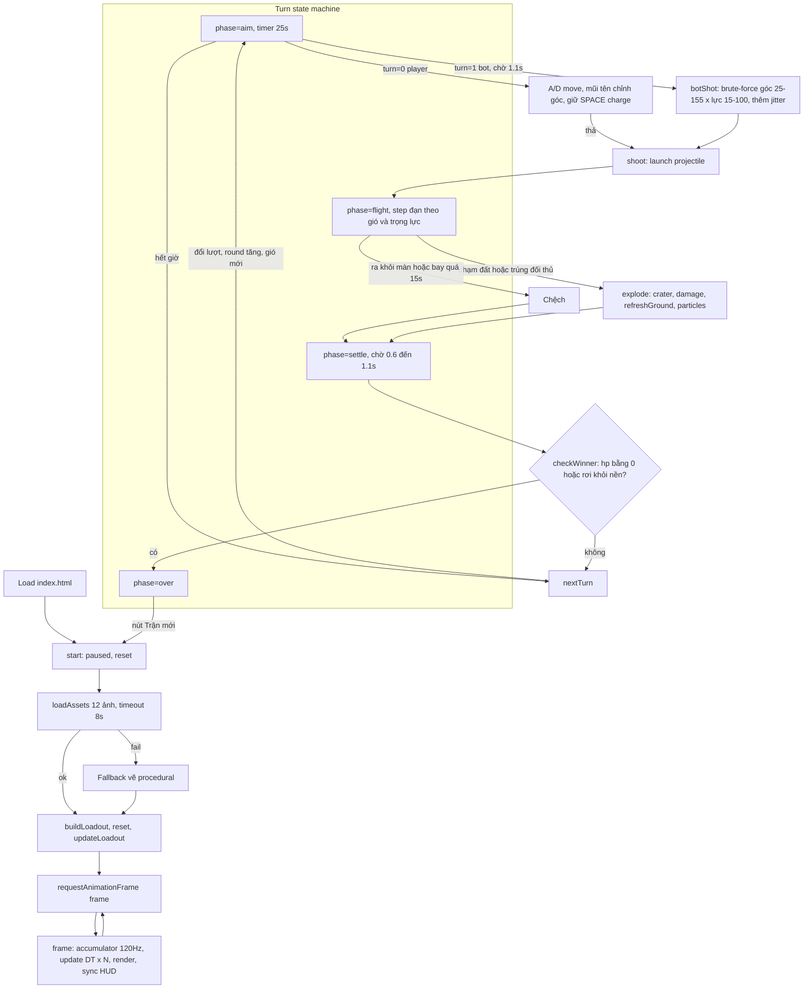

# Review code · Gunny Chibi Arena v0.2

Ngày review: 2026-09-15. Phạm vi: toàn bộ `src/`, `index.html`, `tests/`, `scripts/`.

## Tổng quan

Vanilla JS, không build step, không backend. Bốn file nguồn, khoảng 840 dòng. Tách lớp rõ:

| File | Vai trò |
|---|---|
| `src/physics.js` | Logic thuần: heightmap địa hình, đạn, crater, sát thương, bot AI. Không chạm DOM. Có unit test. |
| `src/assets.js` | Manifest 12 asset và loader có timeout, fallback. |
| `src/sprites.js` | Vẽ sprite nhân vật, vũ khí; cache layer địa hình. |
| `src/game.js` | State machine trận đấu, input, render Canvas, HUD. File lớn nhất, gần 700 dòng. |

Trạng thái kiểm tra: `npm test` 5/5 pass, `npm run check` pass.

## Flow app



Đường vào state từ input:

- Pointer trên `#fire`, `#left`, `#right` dùng `setPointerCapture`; keyboard bắt ở window. Cả hai ghi vào `keys` Set và cờ `charging`.
- `#help` hoặc tab bị ẩn đặt `paused = true` và xóa keys.
- Nút loadout chỉ đổi skin hoặc vũ khí khi player đang ở phase aim.

## Điểm tốt

- Physics thuần, có test, fixed-timestep 120 Hz với clamp 0.1 s mỗi frame.
- Fallback asset đầy đủ: mất ảnh vẫn chơi được. Smoke test Playwright cover case này.
- Layer địa hình chỉ rebuild sau crater, không rebuild mỗi frame.
- Accessibility: aria-label, aria-pressed, dialog native, HUD là HTML.

## Vấn đề và feedback

Đã fix trong commit này:

- **Hardcode tên bot "Hạt Dẻ" trong message.** `nextTurn()` và `checkWinner()` dùng chuỗi cố định. Đã đổi sang `actors[1].name` để đổi skin bot sau này không lệch text.
- **Ba con số khác nhau cho "tâm nhân vật".** `damage()` dùng `y - 20`, hit-test đạn dùng `y - 25`, sprite cao 112. Đã gom thành hằng `BODY_OFFSET = 20` trong `physics.js`, dùng chung cho damage và hit-test. Hit-box đạn dịch xuống 5 px so với trước, không đổi test.

Chưa fix, cần quyết định:

1. **Bot brute-force trên main thread.** Mỗi lượt bot chạy khoảng 1.900 lần `simulate`, mỗi lần tối đa 1.800 step, tổng cỡ 3,4 triệu step. Máy yếu có thể khựng 100 đến 300 ms. Chưa có report lag. Nếu cần: Web Worker hoặc giảm mật độ lưới góc và lực.
2. **State player một phần nằm trong DOM.** `$("angle").value` là source of truth cho góc bắn của player, còn `actors[1].angle` là source cho bot. Không bug, nhưng khó test và khó mở rộng sang bot-vs-bot hoặc multiplayer. Nếu mở rộng, chuyển góc player vào `actors[0].angle` và chỉ sync ra slider.
3. **Fallback vẽ nhân vật procedural** trong `character()` khoảng 80 dòng ellipse hardcode, cộng fallback nền và địa hình khoảng 100 dòng nữa. Chỉ chạy khi ảnh lỗi. Giữ hay bỏ tùy quyết định. Bỏ giảm game.js khoảng 30 phần trăm.
4. **`move()` gọi `checkWinner()`** dù di chuyển không thể rơi khỏi nền, vì `y` luôn bằng `terrain[x]`. Vô hại, có thể bỏ.
5. **Bot cố định skin `hat-de`**, cũng là lựa chọn của player. Chọn Hạt Dẻ thì hai bên trùng sprite. Khi asset mới về, cân nhắc bot chọn random skin khác player.
6. **Smoke test Playwright không nằm trong `npm test`.** Chấp nhận được với repo static, nhưng nên ghi rõ trong README cách chạy.

## Lưu ý khi thay asset mới

- Loader đọc manifest trong `src/assets.js`. Thêm hoặc đổi asset chỉ cần sửa `CHARACTERS`, `WEAPONS`, `ENVIRONMENT`. ID phải khớp với `actors[].skin` và `actors[].weapon`.
- Sprite nhân vật: PNG nền trong suốt, pose idle quay phải, chân ở đáy ảnh. Runtime đặt chân tại `actor.y`, scale cao 112 px, lật ngang khi ngắm trái.
- Sprite vũ khí: vẽ tại `actor.y - 30`, kích thước 48x36, xoay theo góc, lật dọc khi góc lớn hơn 90.
- Nền: 2:1, vẽ full 1200x620. Địa hình: texture cắt theo heightmap, phần trên `terrain[x]` bị xóa.
- Ảnh tải lỗi hoặc quá 8 s rơi về vẽ procedural. Kiểm tra bằng cách chặn `**/assets/**` như trong `scripts/browser-smoke.cjs`.
- Smoke test giả định đúng 4 nhân vật và 6 vũ khí. Đổi số lượng thì sửa test.

## Đánh giá khả năng mở rộng

Phần này trả lời: code hiện tại chịu được những thay đổi nào, cần đụng chỗ nào, và cái gì nên làm trước.

### 1. Thay đổi skin

Hiện trạng:

- `CHARACTERS` trong `src/assets.js` chỉ có `id`, `name`, `file`. Skin thuần cosmetic, không có chỉ số.
- Player chọn skin bất kỳ lúc nào trong phase aim của mình, kể cả giữa trận. Bot cố định `hat-de`.
- `drawCharacter()` vẽ một ảnh tĩnh, lật ngang theo hướng ngắm. Không có frame.

Mở rộng dễ:

- Bot chọn skin random khác player: sửa `reset()` trong `src/game.js`, lọc `CHARACTERS` bỏ `selectedCharacter`. Khoảng 3 dòng.
- Thêm skin mới: thêm một dòng vào `CHARACTERS` và một file PNG. Smoke test đang assert đúng 4 nhân vật, phải sửa theo.

Mở rộng cần cân nhắc:

- Nếu skin có chỉ số (HP, năng lượng di chuyển, sát thương), phải khóa chọn skin trước trận, không cho đổi giữa trận như hiện tại. Loadout hiện chỉ cần điều kiện `turn === 0 && phase === "aim"`. Sẽ cần thêm phase `lobby` trước `aim`.
- Chỉ số per-skin nên nằm trong manifest `CHARACTERS` (ví dụ `hp: 100`, `energy: 60`) và `reset()` đọc từ đó. Tránh rải số cứng như `hp: 100`, `energy = 60` hiện tại.

### 2. Loại đạn và ảnh hưởng vật lý

Hiện trạng:

- `WEAPONS` chỉ có `id`, `name`, `file`, `color`. HTML ghi rõ "Cùng chỉ số, khác diện mạo".
- Vật lý cố định: `launch()` tốc độ `160 + power * 6`, `GRAVITY = 290`, gió cộng thẳng vào `vx` mỗi step. `crater()` bán kính mặc định 48. `damage()` tối đa 42, tắt ở khoảng cách 95.
- Bot dùng `simulate()` với cùng `launch()` và `step()`, nên bot tự động đúng với mọi thay đổi vật lý miễn là thay đổi đi qua hai hàm đó.

Đề xuất thiết kế: thêm object `ammo` vào mỗi weapon, lưu các tham số lên projectile khi `launch()`, `step()` đọc từ projectile.

```js
// assets.js
{ id: "acorn", name: "Cối hạt dẻ", file: "...", color: "...",
  ammo: { gravityScale: 1.3, windScale: 0.5, craterRadius: 60, damageMax: 55, damageRadius: 80 } }
{ id: "bubble", name: "Súng bong bóng", file: "...", color: "...",
  ammo: { gravityScale: 0.6, windScale: 2.0, craterRadius: 30, damageMax: 28, damageRadius: 110 } }
```

```js
// physics.js
export function launch(actor, angle, power, ammo = DEFAULT_AMMO) { ...; return { x, y, vx, vy, age: 0, ammo }; }
export function step(p, wind, dt = DT) { p.vx += wind * p.ammo.windScale * dt; p.vy += GRAVITY * p.ammo.gravityScale * dt; ... }
export function damage(actor, x, y, ammo = DEFAULT_AMMO) { ... ammo.damageMax * (1 - d / ammo.damageRadius) ... }
```

`crater()` đã nhận `r`, chỉ cần `explode()` truyền `p.ammo.craterRadius`. `botShot()` và `simulate()` thêm tham số `ammo`. Test hiện tại giữ được nhờ giá trị mặc định.

Tính hợp lý vật lý, gợi ý cho 6 vũ khí hiện có:

| Vũ khí | Ý tưởng | gravityScale | windScale | craterRadius | damageMax | Ghi chú |
|---|---|---|---|---|---|---|
| Cà rốt | Chuẩn | 1.0 | 1.0 | 48 | 42 | Giữ nguyên, làm mốc |
| Hạt dẻ | Nặng, phá đất | 1.3 | 0.5 | 64 | 50 | Tầm ngắn, bot dễ đoán |
| Mật ong | Dính | 1.0 | 1.0 | 24 | 30 | Đối thủ mất 30 năng lượng lượt sau. Cần thêm trạng thái `slowed` trên actor |
| Bong bóng | Nhẹ, bay theo gió | 0.6 | 2.0 | 20 | 28 | Khó ngắm, ít phá đất |
| Cá nước | Xói mòn | 1.0 | 1.0 | 40 | 25 | Crater rộng nhưng nông: thêm tham số `craterDepth`, `crater()` hiện dùng nửa hình tròn, cần sửa thành ellipse |
| Ná sao | Chùm | 0.9 | 1.0 | 18 x 3 | 18 x 3 | Tách 3 viên tại đỉnh quỹ đạo (`vy` đổi dấu). Cần `projectile` thành mảng |

Cân bằng cần chú ý:

- Crater lớn không chỉ tăng sát thương gián tiếp mà còn làm actor rơi khỏi nền nhanh hơn. Địa hình ở khoảng y 400 đến 476, ngưỡng rơi `HEIGHT - 20 = 600`. Với bán kính 64, ba phát trúng cùng chỗ đủ giết bằng rơi. Nên giới hạn `craterRadius` tối đa khoảng 64, hoặc thêm sàn đá không phá được tại y 560.
- Hiện không có sát thương rơi. Actor tụt xuống crater không mất máu. Nếu muốn hợp lý hơn: trong `explode()`, lưu `y` cũ, nếu `newY - oldY > 40` thì trừ thêm `(newY - oldY) / 4` HP. Nhỏ, dễ test.
- `damage()` đo tới `BODY_OFFSET` trên chân, còn crater khoét từ điểm nổ. Đạn nổ dưới chân thì damage nhỏ hơn đạn nổ ngang ngực dù cùng khoảng cách ngang. Chấp nhận được, đúng cảm giác Gunny.
- Bot brute-force đang ~1.900 sim mỗi lượt. Nếu bot cũng được chọn vũ khí thì nhân theo số vũ khí. Nên cho bot vũ khí cố định hoặc chọn trước lượt rồi chỉ sim một loại.
- Đạn chùm và đạn dính làm `phase` phức tạp hơn: `flight` phải chờ mọi viên kết thúc. Làm sau cùng.

### 3. Hiệu ứng đường đạn

Hiện trạng:

- Projectile là ellipse màu `weapon.color`, bán kính 8, không xoay.
- Trail: mỗi step 40 phần trăm xác suất push điểm, tối đa 50 điểm, vẽ ellipse mờ dần màu cố định `#fff9dfbb`. Trail phụ thuộc số step, nghĩa là phụ thuộc thời gian bay, không phụ thuộc quãng đường.
- Đường ngắm dự đoán khi aim: 38 step 0.025 s, vẽ chấm mỗi 4 step. Chưa dùng `ammo`, sau khi thêm ammo phải truyền vào để đường ngắm đúng với đạn.

Đề xuất theo chi phí tăng dần:

1. Trail lấy màu từ `weapon.color`. Một dòng.
2. Projectile xoay theo hướng bay bằng `Math.atan2(vy, vx)`, vẽ sprite đạn thay ellipse. Cần 6 sprite đạn nhỏ, khoảng 32x32, nền trong suốt, hướng phải. Thêm vào `WEAPONS` field `projectile`.
3. Trail theo loại đạn: bong bóng để lại bọt nhỏ nổi lên, hạt dẻ để lại khói, sao để lại lấp lánh. Biến `trail` thành mảng particle có `vx`, `vy`, `life` như `particles` hiện tại, tái dùng vòng update.
4. Camera theo đạn hoặc zoom khi đạn bay cao hơn màn hình. Hiện đạn bay quá `y < 0` vẫn tiếp tục nhưng không nhìn thấy. Có thể thêm mũi tên chỉ vị trí đạn trên đỉnh màn hình, rẻ hơn camera.

### 4. Animation

Hiện trạng:

- Sprite tĩnh, một pose idle mỗi nhân vật. `assets/README.md` ghi rõ không có sheet đi bộ hay bắn.
- Hiệu ứng duy nhất: 28 particle nổ sống 0,7 s, tam giác vàng chỉ lượt, trail.
- Vòng lặp `frame()` gọi `update(DT)` cố định rồi `render()`. Animation phải tính trong `render()` theo thời gian thực, không nhét vào `update()` để giữ vật lý deterministic.

Hai hướng:

Hướng A, procedural, không cần asset mới. Làm được ngay:

- Đi bộ: nhún dọc `sin(time * 12) * 3` khi `keys` có left hoặc right.
- Bắn: recoil, dịch sprite ngược hướng ngắm 6 px trong 0,15 s, vũ khí giật.
- Trúng đạn: nhấp nháy trắng 0,2 s bằng `globalCompositeOperation = "lighter"` hoặc tô đè ellipse trắng alpha.
- Charge lực: sprite rung nhẹ theo `charge`.
- Nổ: rung màn hình, `ctx.translate` ngẫu nhiên 4 px trong 0,3 s, giảm dần.
- Số sát thương bay lên từ đầu actor, sống 1 s.
- Thắng thua: sprite nhảy hoặc ngã bằng `rotate`.

Tất cả cần một mảng `tweens` hoặc vài timestamp trong `game.js`, khoảng 60 đến 80 dòng. Không đụng physics.

Hướng B, sprite nhiều frame. Cần asset:

- Image generator tạo sheet nhiều frame thường không nhất quán về scale, anchor và màu giữa frame. Khuyến nghị yêu cầu từng pose riêng lẻ thay vì sheet: `idle`, `fire`, `hurt`, `win` cho mỗi nhân vật, cùng kích thước canvas, chân cùng baseline. Tổng 16 PNG cho 4 nhân vật.
- Loader hiện tại tải từng file, không cần sửa. `CHARACTERS` thêm `poses: { idle, fire, hurt }`. `drawCharacter()` nhận tên pose.
- Không nên làm walk cycle bằng AI, tốn nhiều frame và hay lỗi. Dùng nhún procedural của hướng A.

Khuyến nghị: làm A trước, dùng B chỉ cho 3 pose `fire`, `hurt`, `win`.

### 5. Thứ tự đề xuất

| Bước | Việc | Đụng file | Rủi ro | Cần asset mới |
|---|---|---|---|---|
| 1 | Bot random skin khác player | game.js | Thấp | Không |
| 2 | Trail theo màu vũ khí, đạn xoay theo hướng bay | game.js | Thấp | Không |
| 3 | Animation procedural: recoil, nháy khi trúng, rung màn hình, số sát thương | game.js | Thấp | Không |
| 4 | Ammo params: gravityScale, windScale, craterRadius, damageMax, damageRadius; truyền qua launch, step, damage, botShot; đường ngắm dùng ammo | physics.js, assets.js, game.js, tests | Trung bình, cần rebalance và sửa test | Không |
| 5 | Sát thương rơi và sàn đá | physics.js, game.js, tests | Thấp | Không |
| 6 | Sprite đạn riêng | assets.js, game.js | Thấp | 6 PNG 32x32 |
| 7 | Pose fire, hurt, win | assets.js, sprites.js, game.js | Thấp | 12 PNG |
| 8 | Đạn dính, đạn chùm | physics.js, game.js | Cao, đổi state machine | Không |

Mỗi bước là một commit riêng, test pass trước và sau.

### 6. Danh sách asset cần đặt hàng

Gửi cho model thiết kế asset, cùng style với pack hiện tại:

- 6 sprite đạn, 32x32, nền trong suốt, hướng phải, không bóng đổ: cà rốt, hạt dẻ, giọt mật, bong bóng, cá, sao.
- 4 nhân vật x 3 pose `fire`, `hurt`, `win`, cùng canvas và baseline với pose idle hiện có, hướng phải, tay trống, có gutter 4 px như pack cũ.
- Tùy chọn: 1 sprite hiệu ứng nổ 3 frame 96x96, nếu muốn thay particle. Không bắt buộc, particle hiện tại đủ dùng.
