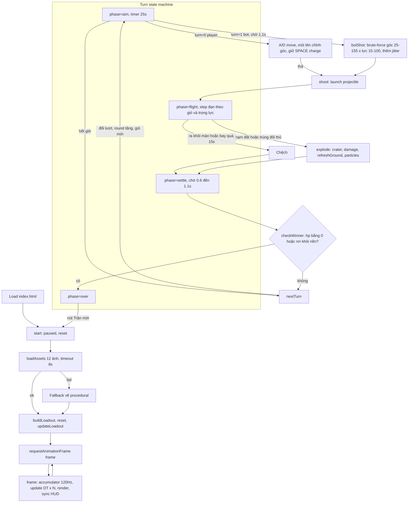

# Review code · Gunny Chibi Arena v0.2

Ngày review: 2026-09-15. Phạm vi: toàn bộ `src/`, `index.html`, `tests/`, `scripts/`.

## Tổng quan

Vanilla JS, không build step, không backend. Bốn file nguồn, khoảng 840 dòng. Tách lớp rõ:

| File | Vai trò |
|---|---|
| `src/physics.js` | Logic thuần: heightmap địa hình, đạn, crater, sát thương, bot AI. Không chạm DOM. Có unit test. |
| `src/assets.js` | Manifest 12 asset và loader có timeout, fallback. |
| `src/sprites.js` | Vẽ sprite nhân vật, vũ khí; cache layer địa hình. |
| `src/game.js` | State machine trận đấu, input, render Canvas, HUD. File lớn nhất, gần 700 dòng. |

Trạng thái kiểm tra: `npm test` 5/5 pass, `npm run check` pass.

## Flow app

Đường vào state từ input:

- Pointer trên `#fire`, `#left`, `#right` dùng `setPointerCapture`; keyboard bắt ở window. Cả hai ghi vào `keys` Set và cờ `charging`.
- `#help` hoặc tab bị ẩn đặt `paused = true` và xóa keys.
- Nút loadout chỉ đổi skin hoặc vũ khí khi player đang ở phase aim.

## Điểm tốt

- Physics thuần, có test, fixed-timestep 120 Hz với clamp 0.1 s mỗi frame.
- Fallback asset đầy đủ: mất ảnh vẫn chơi được. Smoke test Playwright cover case này.
- Layer địa hình chỉ rebuild sau crater, không rebuild mỗi frame.
- Accessibility: aria-label, aria-pressed, dialog native, HUD là HTML.

## Vấn đề và feedback

Đã fix trong commit này:

- **Hardcode tên bot "Hạt Dẻ" trong message.** `nextTurn()` và `checkWinner()` dùng chuỗi cố định. Đã đổi sang `actors[1].name` để đổi skin bot sau này không lệch text.
- **Ba con số khác nhau cho "tâm nhân vật".** `damage()` dùng `y - 20`, hit-test đạn dùng `y - 25`, sprite cao 112. Đã gom thành hằng `BODY_OFFSET = 20` trong `physics.js`, dùng chung cho damage và hit-test. Hit-box đạn dịch xuống 5 px so với trước, không đổi test.

Chưa fix, cần quyết định:

1. **Bot brute-force trên main thread.** Mỗi lượt bot chạy khoảng 1.900 lần `simulate`, mỗi lần tối đa 1.800 step, tổng cỡ 3,4 triệu step. Máy yếu có thể khựng 100 đến 300 ms. Chưa có report lag. Nếu cần: Web Worker hoặc giảm mật độ lưới góc và lực.
2. **State player một phần nằm trong DOM.** `$("angle").value` là source of truth cho góc bắn của player, còn `actors[1].angle` là source cho bot. Không bug, nhưng khó test và khó mở rộng sang bot-vs-bot hoặc multiplayer. Nếu mở rộng, chuyển góc player vào `actors[0].angle` và chỉ sync ra slider.
3. **Fallback vẽ nhân vật procedural** trong `character()` khoảng 80 dòng ellipse hardcode, cộng fallback nền và địa hình khoảng 100 dòng nữa. Chỉ chạy khi ảnh lỗi. Giữ hay bỏ tùy quyết định. Bỏ giảm game.js khoảng 30 phần trăm.
4. **`move()` gọi `checkWinner()`** dù di chuyển không thể rơi khỏi nền, vì `y` luôn bằng `terrain[x]`. Vô hại, có thể bỏ.
5. **Bot cố định skin `hat-de`**, cũng là lựa chọn của player. Chọn Hạt Dẻ thì hai bên trùng sprite. Khi asset mới về, cân nhắc bot chọn random skin khác player.
6. **Smoke test Playwright không nằm trong `npm test`.** Chấp nhận được với repo static, nhưng nên ghi rõ trong README cách chạy.

## Lưu ý khi thay asset mới

- Loader đọc manifest trong `src/assets.js`. Thêm hoặc đổi asset chỉ cần sửa `CHARACTERS`, `WEAPONS`, `ENVIRONMENT`. ID phải khớp với `actors[].skin` và `actors[].weapon`.
- Sprite nhân vật: PNG nền trong suốt, pose idle quay phải, chân ở đáy ảnh. Runtime đặt chân tại `actor.y`, scale cao 112 px, lật ngang khi ngắm trái.
- Sprite vũ khí: vẽ tại `actor.y - 30`, kích thước 48x36, xoay theo góc, lật dọc khi góc lớn hơn 90.
- Nền: 2:1, vẽ full 1200x620. Địa hình: texture cắt theo heightmap, phần trên `terrain[x]` bị xóa.
- Ảnh tải lỗi hoặc quá 8 s rơi về vẽ procedural. Kiểm tra bằng cách chặn `**/assets/**` như trong `scripts/browser-smoke.cjs`.
- Smoke test giả định đúng 4 nhân vật và 6 vũ khí. Đổi số lượng thì sửa test.
